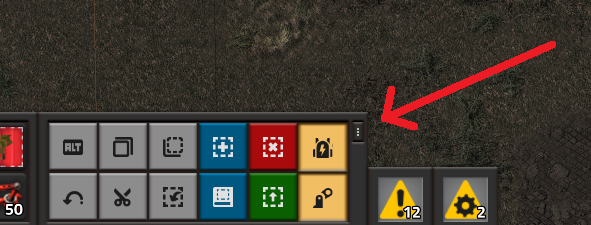

# factorio-tacticalConstruction

Source repository for the Factorio mod Tactical Construction.

## Summary

Tactical Construction is a mod for the video game [Factorio](https://factorio.com/). It provides a per-player toggle that - when enabled - prioritizes the local player's roboport for construction requests (as opposed to allowing construction requests to be satisfied by any statically-placed logistics network that overlaps inside the player's mobile roboport).

Tactical Construction on the Factorio mod portal: https://mods.factorio.com/mod/TacticalConstruction

**CAUTION: This mod is still in BETA; you may encounter crashes/corruption.**

## How this Came to Be

My Factorio friends and I love construction robots. After all, who doesn't?

The great news is that the game seems to be pretty good at figuring out the different logistics networks and such and allocating jobs out to available robots. The bad news is that when building out your base, a constant annoyance to me and my friends is that once a construction job is 'assigned out' to the base network, even if the assigned robot is light-years away, the job won't get re-assigned to your local player. I get that that's probably a case of "it's not a bug, it's a feature", and I think I agree. However, the practical aspect of things is sometimes you just want your player's robots to finish the damn template next to you right away so you can get on with your life and build something else.

Rather than complain about it (okay, that's a lie, I complained about it incessantly), I decided to see if I could do something about it. So, after doing some investigation that *cough* might have involved a little bit of disassembling the native executable using the included PDB file for symbols (what can I say, I'm obsessive at times) I finally realized how the game's robot scheduling algorithm worked. Reviewing the various nested loops and calls, suddenly clicked to me that if I was to create a separate force in the game, the construction requests would be scheduled separately.

Hence this horrible idea of a mod was formed. When you toggle the button on, your player and any entities needing construction within your player's roboport, get moved to an alternate force. This has the effect of prioritizing your local roboport at the expense of causing various negative side effects. (So far they all seem to be temporary, although not sure.)

## Usage Instructions

1. Un-hide the Tactical Construction toggle button on your shortcut bar:
   - On the top right of your shortcut bar, there is a small "..." button that lets you customize the bar. Click it to show the customization menu. 
   
   - Enable display of the custom shortcut button by clicking the checkbox next to it. If the checkbox will not enable, you may need to first uncheck something else to make room. 
   
2. Have a personal roboport in your player's armor, construction robots and supplies for building in inventory, etc. Just like normal.
3. Keep the Tactical Construction button toggled off under regular play.
4. Upon encountering an issue where your base's robot network is scheduled to build something that you want to build w your player, toggle the button on:
   - When enabled, your player and any entities needing construction around you will be transported to an 'alternative' force in the game that is auto-created and - to the maximum extent possible - synced with your regular force.
   - However, even allied forces don't fulfill each-other's construction requests. This means your player's robots will handle the construction despite your base's network overlapping.
   - As you move, now-out-of-range entities are sent back to your base's primary force. And new in-range entities needing construction are moved to the alternative force.
5. Once the construction is complete, toggle off the button. You will be sent back to your primary force and any as-yet alternate-force entities will be reverted along with you.

## Considerations

1. This mod auto-creates one alternative (allied) force per each player force. In most games there is one player force (thus, only one alternative force will be created); however, this mod tries to handle scenarios where there are multiple player forces (each getting its own alternate force).
2. Due to the alternate force behavior, once you save your game with this mod active, it's probably not advisable to disable the mod on that save file moving forward.  Tactical Construction makes a point to clean up any alternative forces when there are no longer any connected players that might use them; however, if you disable the mod, that logic will of course not be able to run to clean up any alternative forces that were still determined to be needed at the point of save.
   - I **may** eventually add a console command that can be used to tell the mod to clean itself up and go into a permanent 'zombie' state. This could be run right before saving the game, after which the mod could be disabled. File a Github issue if something like this would be of use to you.

## Limitations

1. Deconstruction: Does not work with to-be-deconstructed entities. At present there's no efficient way to find entities marked for deconstruction. Enhancement request has been submitted here: https://forums.factorio.com/viewtopic.php?t=82643
   1. In the mean time, I may eventually experiment with iterating through entities and manually filtering them to find ones marked for deconstruction.
2. Base entity disco: At present, a force's "color" (i.e. the color applied to all entities on that force) appears to be automatically equivalent to the color of the first player member of the force. As a result, when player #1 in a multiplayer game toggles the feature (and gets moved to the alternative force), the primary force color will change to player #2's color. Upon player #1 toggling the feature off, the force color reverts. Thus, you get a sort of "light show" every time player #1 uses this feature.
   1. Enhancement request submitted here: https://forums.factorio.com/viewtopic.php?t=82644
   2. Workaround: Set player colors to the same value :-)
3. Map fog-of-war: When players have the feature enabled, they are moved to a different force in the game. This means that the discovered areas of the map will be reset. I've enabled map sharing between the two forces, but it only seems to share scans of a sector upon next active scan. Thus, your map will likely be significantly-less explored while you have the feature on.
4. Force weapon attributes: At present I don't sync a bunch of force damage attributes from the primary force over the the alternative one. So if you're gonna fight, maybe toggle the feature off first :-)

## Technical Details

When a player joins, the mod reads their 'force' attribute and creates an 'alternative' version of that force.  When the feature is toggled on (via the button at top-left of the screen), the player and all ghost or to-be-upgraded entities in range of the player's roboport are transported to the alternative force.  Upon disabling the feature, the player and all nearby entities are sent 'home' to the original force.

This seems like it should be pretty trivial (which is why I naively set out to make this mod), but actually there are a few problems:

1. The alternative force needs to have the various technologies and resulting stats from the primary force synced over:
   1. To make this happen, I copied a bunch of code from LogiNetChannels: https://github.com/ceresward/factorio-logiNetChannels
2. Upon moving a player to a different force, the player's follower construction robots get 'orphaned'.  I thus went through rather great lengths to port the robots over and reattach them to the player.
3. When the player moves and the feature is toggled on, of course the 'in range' entities change.  We therefore need to revert any now-out-of-range entities back to the pimary force so that they aren't sitting there unserviced forever (that would be just plain rude).  We preserve the player's previous bounding box, but we of course don't want to revert any still-in-range entities (old box and new box likely overlap). Originally I was using API calls to try to detect which entities were still in range vs not, but this proved WAY too slow. So instead I threw together some really hacky 'rectangle subtraction' logic to arrive at a set of rectangles that do not include the player's current robotport rectangle.
